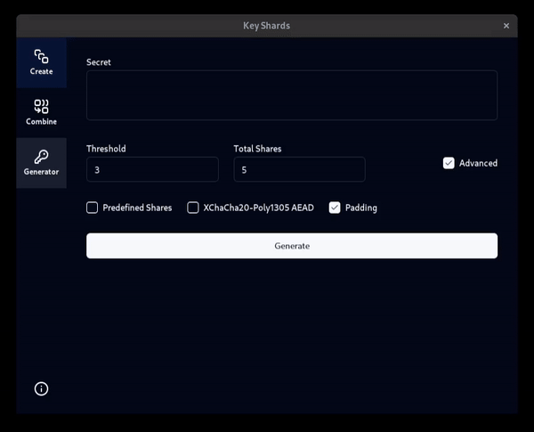

<div align="center">
  <a href="https://github.com/euandeas/key-shards">
    
  </a>

  <h3 align="center">Key Shards</h3>

  <p align="center">
    A distributed backup application for secrets, using Shamir's Secret Sharing.
  </p>
</div>

# About

Key Shards is a distributed backup application for private keys, passwords or any other important information. Several shares are produced and only a subset of them are required to reveal the secret.

This program would not be suitable for backing up every password that you use, a password manager is more suited for this job. However, this program is suited for backing up master passwords or the secret key that some services give you (e.g. 1Password or Proton). Other use cases include cryptocurrency wallet keys or succession planning.

Unlike conventional secret sharing, this is not targeted towards distributing a secret among a group, but instead the personal backup of secrets. However, this application can be used for this conventional purpose if you understand what you are doing and the surrounding security risks.

This is based on an implementation of <a href="https://en.wikipedia.org/wiki/Shamir's_secret_sharing">Shamir's Secret Sharing</a> written in Rust which can be found [here](../shami_rs/README.md).

## Features

- Runs on Windows, macOS & Linux
- Free, open-source & auditable
- Custom Rust Shamir's Secret Sharing implementation that supports
    - XChaCha20-Poly1305 AEAD wrapper
    - BIP Mnemonic compression wrapper
    - Secret Padding
    - **Experimental** - Up to 2 shorter predefined shares for long secrets
- Built-in password generator
- Export shares as text, PEM files (<a href="https://datatracker.ietf.org/doc/html/rfc7468">RFC 7468</a>) or QR codes.
- Scan QR codes if your device has a camera

## Built With

Rust, Tauri & SvelteKit

# Getting Started 

If you want to build the project yourself you can follow the steps below. This can be done on Mac, Windows or Linux.

## Prerequisites

1. Install <a href="https://tauri.app/v1/guides/getting-started/prerequisites">Tauri Prerequisites & Rust</a>.
2. Install <a href="https://nodejs.org/en/learn/getting-started/how-to-install-nodejs">Node.js</a>
3. Install the <a href="https://opencv.org/get-started/">OpenCV for C++</a>.

## Installation

If you do not already have the source code:
```
git clone https://github.com/euandeas/key-shards.git
cd key-shards/key-shards
```

Once inside the project directory, to get the program to run:
```
npm install
npm run tauri dev
```

# Usage

Creating Shares:

<br />

Combining Shares:

<br />

# License

Licensed under either of

 * Apache License, Version 2.0
   ([LICENSE-APACHE](LICENSE-APACHE) or http://www.apache.org/licenses/LICENSE-2.0)
 * MIT license
   ([LICENSE-MIT](LICENSE-MIT) or http://opensource.org/licenses/MIT)

at your option.

# Contribution

Unless you explicitly state otherwise, any contribution intentionally submitted for inclusion in the work by you, as defined in the Apache-2.0 license, shall be dual licensed as above, without any additional terms or conditions.
